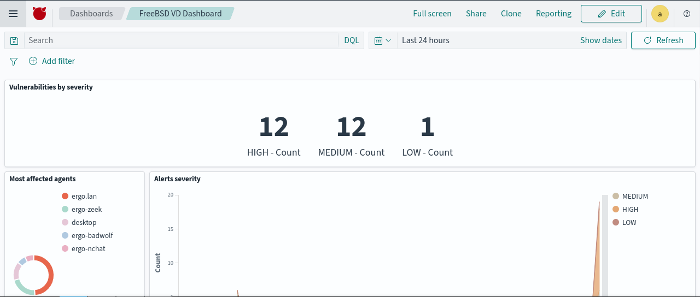
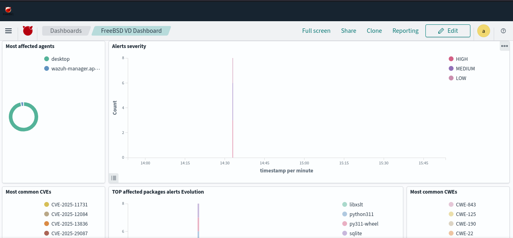
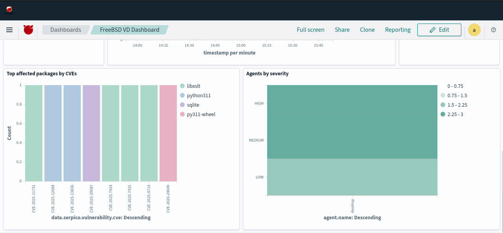

# Serpico

**serpico** is a security scanner for FreeBSD packages and releases that compares the versions against a list of versions marked as vulnerable, then displays vulnerability information in a JSON-compact format for easy analysis by other security tools.

## Installation

**Bleeding-edge version**:

```sh
pkg install -y python314 py311-pipx
pipx install --system-site-packages --force --global --python 3.14 git+https://github.com/DtxdF/serpico.git
```

**Stable version**:

```sh
pkg install -y py311-serpico
```

## Wazuh

The main goal of this tool is to implement vulnerability detection in FreeBSD's Wazuh, as it is currently an unsupported platform, so I have prepared some rules for alerts. There is no need to create decoders, as Wazuh already decodes the logs that are in JSON. See [ossec/etc/rules/local_rules.xml](ossec/etc/rules/local_rules.xml).

On the agent side, you must add the following to your `ossec.conf`:

```
<wodle name="command">
  <tag>serpico</tag>
  <disabled>no</disabled>
  <command>/usr/local/bin/serpico --scan-jails</command>
  <interval>12h</interval>
  <ignore_output>no</ignore_output>
  <run_on_start>yes</run_on_start>
  <timeout>0</timeout>
</wodle>
```

### Wazuh Dashboard





Thanks to [Nicolas Curioni](https://groups.google.com/g/wazuh/c/N6-t0jTaBrY/m/8v3HMzgJBAAJ), we have a handy dashboard to display a summary of our systems' vulnerabilities. I just edited the ndjson so that the parameters match those used by Serpico.

To install **FreeBSD VD Dashboard** simply click the hamburger button and select `Dashboard Management > Saved Objects`, then import the [ndjson](wazuh-dashboard/FreeBSD_VD_Dashboard.ndjson) file.

## Examples

1. Check if the host is vulnerable or has any vulnerable packages:

```sh
serpico
```

2. Same as above, but use the NVD API key:

```sh
serpico --nvd-api-key-file "$HOME/.nvd-api-key"
```

3. Scan all jails that have the meta parameter `meta.serpico`:

```
serpico --scan-jails
```

### Sample session

```console
# serpico --nvd-api-key-file /home/user/.nvd-api-key --scan-jails
===> Starting Serpico ( category:release, jail:None ) at 2026-01-24 18:14 -04
===> Reading security feed from 'https://www.freebsd.org/security/feed.xml'
===> Reading security advisory 'FreeBSD-EN-25:20.vmm' from 'https://www.freebsd.org/security/advisories/FreeBSD-EN-25:20.vmm.asc'
===> Reading security advisory 'FreeBSD-EN-25:19.zfs' from 'https://www.freebsd.org/security/advisories/FreeBSD-EN-25:19.zfs.asc'
===> Reading security advisory 'FreeBSD-EN-25:18.freebsd-update' from 'https://www.freebsd.org/security/advisories/FreeBSD-EN-25:18.freebsd-update.asc'
===> Reading security advisory 'FreeBSD-EN-25:17.bnxt' from 'https://www.freebsd.org/security/advisories/FreeBSD-EN-25:17.bnxt.asc'
===> Reading security advisory 'FreeBSD-EN-25:16.vfs' from 'https://www.freebsd.org/security/advisories/FreeBSD-EN-25:16.vfs.asc'
===> Reading security advisory 'FreeBSD-EN-25:15.arm64' from 'https://www.freebsd.org/security/advisories/FreeBSD-EN-25:15.arm64.asc'
===> Reading security advisory 'FreeBSD-EN-25:14.route' from 'https://www.freebsd.org/security/advisories/FreeBSD-EN-25:14.route.asc'
===> Reading security advisory 'FreeBSD-EN-25:13.wlan_tkip' from 'https://www.freebsd.org/security/advisories/FreeBSD-EN-25:13.wlan_tkip.asc'
===> Reading security advisory 'FreeBSD-EN-25:12.efi' from 'https://www.freebsd.org/security/advisories/FreeBSD-EN-25:12.efi.asc'
===> Reading security advisory 'FreeBSD-EN-25:11.ena' from 'https://www.freebsd.org/security/advisories/FreeBSD-EN-25:11.ena.asc'
===> Reading security advisory 'FreeBSD-SA-25:12.rtsold' from 'https://www.freebsd.org/security/advisories/FreeBSD-SA-25:12.rtsold.asc'
===> Reading security advisory 'FreeBSD-SA-25:11.ipfw' from 'https://www.freebsd.org/security/advisories/FreeBSD-SA-25:11.ipfw.asc'
===> Reading security advisory 'FreeBSD-SA-25:10.unbound' from 'https://www.freebsd.org/security/advisories/FreeBSD-SA-25:10.unbound.asc'
===> Reading security advisory 'FreeBSD-SA-25:09.netinet' from 'https://www.freebsd.org/security/advisories/FreeBSD-SA-25:09.netinet.asc'
===> Reading security advisory 'FreeBSD-SA-25:08.openssl' from 'https://www.freebsd.org/security/advisories/FreeBSD-SA-25:08.openssl.asc'
===> Reading security advisory 'FreeBSD-SA-25:07.libarchive' from 'https://www.freebsd.org/security/advisories/FreeBSD-SA-25:07.libarchive.asc'
===> Reading security advisory 'FreeBSD-SA-25:06.xz' from 'https://www.freebsd.org/security/advisories/FreeBSD-SA-25:06.xz.asc'
===> Reading security advisory 'FreeBSD-SA-25:05.openssh' from 'https://www.freebsd.org/security/advisories/FreeBSD-SA-25:05.openssh.asc'
===> Reading security advisory 'FreeBSD-SA-25:04.ktrace' from 'https://www.freebsd.org/security/advisories/FreeBSD-SA-25:04.ktrace.asc'
===> Reading security advisory 'FreeBSD-SA-25:03.etcupdate' from 'https://www.freebsd.org/security/advisories/FreeBSD-SA-25:03.etcupdate.asc'
##!> Serpico done: found 0 vulnerabilities in 7.39941 seconds
===> Starting Serpico ( category:release, jail:ji386 ) at 2026-01-24 18:14 -04
===> Reading security feed from 'https://www.freebsd.org/security/feed.xml'
===> Reading security advisory 'FreeBSD-EN-25:20.vmm' from 'https://www.freebsd.org/security/advisories/FreeBSD-EN-25:20.vmm.asc'
===> Reading security advisory 'FreeBSD-EN-25:19.zfs' from 'https://www.freebsd.org/security/advisories/FreeBSD-EN-25:19.zfs.asc'
===> Reading security advisory 'FreeBSD-EN-25:18.freebsd-update' from 'https://www.freebsd.org/security/advisories/FreeBSD-EN-25:18.freebsd-update.asc'
===> Reading security advisory 'FreeBSD-EN-25:17.bnxt' from 'https://www.freebsd.org/security/advisories/FreeBSD-EN-25:17.bnxt.asc'
===> Reading security advisory 'FreeBSD-EN-25:16.vfs' from 'https://www.freebsd.org/security/advisories/FreeBSD-EN-25:16.vfs.asc'
===> Reading security advisory 'FreeBSD-EN-25:15.arm64' from 'https://www.freebsd.org/security/advisories/FreeBSD-EN-25:15.arm64.asc'
===> Reading security advisory 'FreeBSD-EN-25:14.route' from 'https://www.freebsd.org/security/advisories/FreeBSD-EN-25:14.route.asc'
===> Reading security advisory 'FreeBSD-EN-25:13.wlan_tkip' from 'https://www.freebsd.org/security/advisories/FreeBSD-EN-25:13.wlan_tkip.asc'
===> Reading security advisory 'FreeBSD-EN-25:12.efi' from 'https://www.freebsd.org/security/advisories/FreeBSD-EN-25:12.efi.asc'
===> Reading security advisory 'FreeBSD-EN-25:11.ena' from 'https://www.freebsd.org/security/advisories/FreeBSD-EN-25:11.ena.asc'
===> Reading security advisory 'FreeBSD-SA-25:12.rtsold' from 'https://www.freebsd.org/security/advisories/FreeBSD-SA-25:12.rtsold.asc'
##!> Found 1 vulnerabilities in '14.3-RELEASE' ( 14.3-RELEASE )
##!> No information was found for 'CVE-2025-14558'
===> Reading security advisory 'FreeBSD-SA-25:11.ipfw' from 'https://www.freebsd.org/security/advisories/FreeBSD-SA-25:11.ipfw.asc'
##!> Found 1 vulnerabilities in '14.3-RELEASE' ( 14.3-RELEASE )
##!> No information was found for 'CVE-2025-14769'
===> Reading security advisory 'FreeBSD-SA-25:10.unbound' from 'https://www.freebsd.org/security/advisories/FreeBSD-SA-25:10.unbound.asc'
##!> Found 1 vulnerabilities in '14.3-RELEASE' ( 14.3-RELEASE )
{"serpico.package.name": "14.3-RELEASE", "serpico.package.version": "14.3-RELEASE", "serpico.package.architecture": "i386", "serpico.package.category": "package", "serpico.vulnerability.title": "CVE-2025-11411 affects 14.3-RELEASE", "serpico.vulnerability.assigner": "sep@nlnetlabs.nl", "serpico.vulnerability.cve": "CVE-2025-11411", "serpico.vulnerability.url": "https://nvd.nist.gov/vuln/detail/CVE-2025-11411", "serpico.vulnerability.published_at": "2025-10-22T13:15:29.210", "serpico.vulnerability.status": "Awaiting Analysis", "serpico.vulnerability.updated": "2025-12-05T11:15:49.723", "serpico.vulnerability.description": "NLnet Labs Unbound up to and including version 1.24.1 is vulnerable to possible domain hijack attacks. Promiscuous NS RRSets that complement positive DNS replies in the authority section can be used to trick resolvers to update their delegation information for the zone. Usually these RRSets are used to update the resolver's knowledge of the zone's name servers. A malicious actor can exploit the possible poisonous effect by injecting NS RRSets (and possibly their respective address records) in a reply. This could be done for example by trying to spoof a packet or fragmentation attacks. Unbound would then proceed to update the NS RRSet data it already has since the new data has enough trust for it, i.e., in-zone data for the delegation point. Unbound 1.24.1 includes a fix that scrubs unsolicited NS RRSets (and their respective address records) from replies mitigating the possible poison effect. Unbound 1.24.2 includes an additional fix that scrubs unsolicited NS RRSets (and their respective address records) from YXDOMAIN and non-referral nodata replies, further mitigating the possible poison effect.", "serpico.vulnerability.severity": "MEDIUM", "serpico.vulnerability.score": 5.7, "serpico.package.generated_cpe": [], "serpico.vulnerability.cve_version": "4.0", "serpico.vulnerability.references": ["https://www.nlnetlabs.nl/downloads/unbound/CVE-2025-11411.txt", "http://www.openwall.com/lists/oss-security/2025/11/26/4", "https://lists.debian.org/debian-lts-announce/2025/11/msg00008.html", "https://lists.debian.org/debian-lts-announce/2025/11/msg00032.html"], "serpico.vulnerability.cwe_references": ["CWE-349"], "serpico.jail": "ji386", "serpico.package.condition": ["< 14.3-RELEASE-p6"]}
===> Reading security advisory 'FreeBSD-SA-25:09.netinet' from 'https://www.freebsd.org/security/advisories/FreeBSD-SA-25:09.netinet.asc'
##!> Found 1 vulnerabilities in '14.3-RELEASE' ( 14.3-RELEASE )
{"serpico.package.name": "14.3-RELEASE", "serpico.package.version": "14.3-RELEASE", "serpico.package.architecture": "i386", "serpico.package.category": "package", "serpico.vulnerability.title": "CVE-2025-24934 affects 14.3-RELEASE", "serpico.vulnerability.assigner": "secteam@freebsd.org", "serpico.vulnerability.cve": "CVE-2025-24934", "serpico.vulnerability.url": "https://nvd.nist.gov/vuln/detail/CVE-2025-24934", "serpico.vulnerability.published_at": "2025-10-22T18:15:34.013", "serpico.vulnerability.status": "Awaiting Analysis", "serpico.vulnerability.updated": "2025-10-22T21:12:32.330", "serpico.vulnerability.description": "Software which sets SO_REUSEPORT_LB on a socket and then connects it to a host will not directly observe any problems.  However, due to its membership in a load-balancing group, that socket will receive packets originating from any host.  This breaks the contract of the connect(2) and implied connect via sendto(2), and may leave the application vulnerable to spoofing attacks.\n\n\n\n\nThe kernel failed to check the connection state of sockets when adding them to load-balancing groups.  Furthermore, when looking up the destination socket for an incoming packet, the kernel will match a socket belonging to a load-balancing group even if it is connected, in violation of the contract that connected sockets\u00a0are only supposed to receive packets originating from the connected host.", "serpico.vulnerability.severity": "MEDIUM", "serpico.vulnerability.score": 5.4, "serpico.package.generated_cpe": [], "serpico.vulnerability.cve_version": "3.1", "serpico.vulnerability.references": ["https://security.freebsd.org/advisories/FreeBSD-SA-25:09.netinet.asc"], "serpico.vulnerability.cwe_references": ["CWE-488"], "serpico.vulnerability.cvss.cvss3.base_score": 5.4, "serpico.vulnerability.cvss.cvss3.exploitability_score": 2.8, "serpico.vulnerability.cvss.cvss3.impact_score": 2.5, "serpico.vulnerability.cvss.cvss3.vector.attack_vector": "NETWORK", "serpico.vulnerability.cvss.cvss3.vector.availability": "NONE", "serpico.vulnerability.cvss.cvss3.vector.confidentiality_impact": "LOW", "serpico.vulnerability.cvss.cvss3.vector.integrity_impact": "LOW", "serpico.vulnerability.cvss.cvss3.vector.privileges_required": "NONE", "serpico.vulnerability.cvss.cvss3.vector.scope": "UNCHANGED", "serpico.vulnerability.cvss.cvss3.vector.user_interaction": "REQUIRED", "serpico.jail": "ji386", "serpico.package.condition": ["< 14.3-RELEASE-p5"]}
===> Reading security advisory 'FreeBSD-SA-25:08.openssl' from 'https://www.freebsd.org/security/advisories/FreeBSD-SA-25:08.openssl.asc'
##!> Found 3 vulnerabilities in '14.3-RELEASE' ( 14.3-RELEASE )
{"serpico.package.name": "14.3-RELEASE", "serpico.package.version": "14.3-RELEASE", "serpico.package.architecture": "i386", "serpico.package.category": "package", "serpico.vulnerability.title": "CVE-2025-9230 affects 14.3-RELEASE", "serpico.vulnerability.assigner": "openssl-security@openssl.org", "serpico.vulnerability.cve": "CVE-2025-9230", "serpico.vulnerability.url": "https://nvd.nist.gov/vuln/detail/CVE-2025-9230", "serpico.vulnerability.published_at": "2025-09-30T14:15:41.050", "serpico.vulnerability.status": "Awaiting Analysis", "serpico.vulnerability.updated": "2025-11-04T22:16:45.360", "serpico.vulnerability.description": "Issue summary: An application trying to decrypt CMS messages encrypted using\npassword based encryption can trigger an out-of-bounds read and write.\n\nImpact summary: This out-of-bounds read may trigger a crash which leads to\nDenial of Service for an application. The out-of-bounds write can cause\na memory corruption which can have various consequences including\na Denial of Service or Execution of attacker-supplied code.\n\nAlthough the consequences of a successful exploit of this vulnerability\ncould be severe, the probability that the attacker would be able to\nperform it is low. Besides, password based (PWRI) encryption support in CMS\nmessages is very rarely used. For that reason the issue was assessed as\nModerate severity according to our Security Policy.\n\nThe FIPS modules in 3.5, 3.4, 3.3, 3.2, 3.1 and 3.0 are not affected by this\nissue, as the CMS implementation is outside the OpenSSL FIPS module\nboundary.", "serpico.vulnerability.severity": "HIGH", "serpico.vulnerability.score": 7.5, "serpico.package.generated_cpe": [], "serpico.vulnerability.cve_version": "3.1", "serpico.vulnerability.references": ["https://github.com/openssl/openssl/commit/5965ea5dd6960f36d8b7f74f8eac67a8eb8f2b45", "https://github.com/openssl/openssl/commit/9e91358f365dee6c446dcdcdb01c04d2743fd280", "https://github.com/openssl/openssl/commit/a79c4ce559c6a3a8fd4109e9f33c1185d5bf2def", "https://github.com/openssl/openssl/commit/b5282d677551afda7d20e9c00e09561b547b2dfd", "https://github.com/openssl/openssl/commit/bae259a211ada6315dc50900686daaaaaa55f482", "https://github.openssl.org/openssl/extended-releases/commit/c2b96348bfa662f25f4fabf81958ae822063dae3", "https://github.openssl.org/openssl/extended-releases/commit/dfbaf161d8dafc1132dd88cd48ad990ed9b4c8ba", "https://openssl-library.org/news/secadv/20250930.txt", "http://www.openwall.com/lists/oss-security/2025/09/30/5", "https://lists.debian.org/debian-lts-announce/2025/10/msg00001.html"], "serpico.vulnerability.cwe_references": ["CWE-125", "CWE-787"], "serpico.vulnerability.cvss.cvss3.base_score": 7.5, "serpico.vulnerability.cvss.cvss3.exploitability_score": 3.9, "serpico.vulnerability.cvss.cvss3.impact_score": 3.6, "serpico.vulnerability.cvss.cvss3.vector.attack_vector": "NETWORK", "serpico.vulnerability.cvss.cvss3.vector.availability": "HIGH", "serpico.vulnerability.cvss.cvss3.vector.confidentiality_impact": "NONE", "serpico.vulnerability.cvss.cvss3.vector.integrity_impact": "NONE", "serpico.vulnerability.cvss.cvss3.vector.privileges_required": "NONE", "serpico.vulnerability.cvss.cvss3.vector.scope": "UNCHANGED", "serpico.vulnerability.cvss.cvss3.vector.user_interaction": "NONE", "serpico.jail": "ji386", "serpico.package.condition": ["< 14.3-RELEASE-p4"]}
{"serpico.package.name": "14.3-RELEASE", "serpico.package.version": "14.3-RELEASE", "serpico.package.architecture": "i386", "serpico.package.category": "package", "serpico.vulnerability.title": "CVE-2025-9231 affects 14.3-RELEASE", "serpico.vulnerability.assigner": "openssl-security@openssl.org", "serpico.vulnerability.cve": "CVE-2025-9231", "serpico.vulnerability.url": "https://nvd.nist.gov/vuln/detail/CVE-2025-9231", "serpico.vulnerability.published_at": "2025-09-30T14:15:41.190", "serpico.vulnerability.status": "Awaiting Analysis", "serpico.vulnerability.updated": "2025-11-04T22:16:45.490", "serpico.vulnerability.description": "Issue summary: A timing side-channel which could potentially allow remote\nrecovery of the private key exists in the SM2 algorithm implementation on 64 bit\nARM platforms.\n\nImpact summary: A timing side-channel in SM2 signature computations on 64 bit\nARM platforms could allow recovering the private key by an attacker..\n\nWhile remote key recovery over a network was not attempted by the reporter,\ntiming measurements revealed a timing signal which may allow such an attack.\n\nOpenSSL does not directly support certificates with SM2 keys in TLS, and so\nthis CVE is not relevant in most TLS contexts.  However, given that it is\npossible to add support for such certificates via a custom provider, coupled\nwith the fact that in such a custom provider context the private key may be\nrecoverable via remote timing measurements, we consider this to be a Moderate\nseverity issue.\n\nThe FIPS modules in 3.5, 3.4, 3.3, 3.2, 3.1 and 3.0 are not affected by this\nissue, as SM2 is not an approved algorithm.", "serpico.vulnerability.severity": "MEDIUM", "serpico.vulnerability.score": 6.5, "serpico.package.generated_cpe": [], "serpico.vulnerability.cve_version": "3.1", "serpico.vulnerability.references": ["https://github.com/openssl/openssl/commit/567f64386e43683888212226824b6a179885a0fe", "https://github.com/openssl/openssl/commit/cba616c26ac8e7b37de5e77762e505ba5ca51698", "https://github.com/openssl/openssl/commit/eed5adc9f969d77c94f213767acbb41ff923b6f4", "https://github.com/openssl/openssl/commit/fc47a2ec078912b3e914fab5734535e76c4820c2", "https://openssl-library.org/news/secadv/20250930.txt", "http://www.openwall.com/lists/oss-security/2025/09/30/5"], "serpico.vulnerability.cwe_references": ["CWE-385"], "serpico.vulnerability.cvss.cvss3.base_score": 6.5, "serpico.vulnerability.cvss.cvss3.exploitability_score": 3.9, "serpico.vulnerability.cvss.cvss3.impact_score": 2.5, "serpico.vulnerability.cvss.cvss3.vector.attack_vector": "NETWORK", "serpico.vulnerability.cvss.cvss3.vector.availability": "LOW", "serpico.vulnerability.cvss.cvss3.vector.confidentiality_impact": "LOW", "serpico.vulnerability.cvss.cvss3.vector.integrity_impact": "NONE", "serpico.vulnerability.cvss.cvss3.vector.privileges_required": "NONE", "serpico.vulnerability.cvss.cvss3.vector.scope": "UNCHANGED", "serpico.vulnerability.cvss.cvss3.vector.user_interaction": "NONE", "serpico.jail": "ji386", "serpico.package.condition": ["< 14.3-RELEASE-p4"]}
{"serpico.package.name": "14.3-RELEASE", "serpico.package.version": "14.3-RELEASE", "serpico.package.architecture": "i386", "serpico.package.category": "package", "serpico.vulnerability.title": "CVE-2025-9232 affects 14.3-RELEASE", "serpico.vulnerability.assigner": "openssl-security@openssl.org", "serpico.vulnerability.cve": "CVE-2025-9232", "serpico.vulnerability.url": "https://nvd.nist.gov/vuln/detail/CVE-2025-9232", "serpico.vulnerability.published_at": "2025-09-30T14:15:41.313", "serpico.vulnerability.status": "Awaiting Analysis", "serpico.vulnerability.updated": "2025-11-04T22:16:45.630", "serpico.vulnerability.description": "Issue summary: An application using the OpenSSL HTTP client API functions may\ntrigger an out-of-bounds read if the 'no_proxy' environment variable is set and\nthe host portion of the authority component of the HTTP URL is an IPv6 address.\n\nImpact summary: An out-of-bounds read can trigger a crash which leads to\nDenial of Service for an application.\n\nThe OpenSSL HTTP client API functions can be used directly by applications\nbut they are also used by the OCSP client functions and CMP (Certificate\nManagement Protocol) client implementation in OpenSSL. However the URLs used\nby these implementations are unlikely to be controlled by an attacker.\n\nIn this vulnerable code the out of bounds read can only trigger a crash.\nFurthermore the vulnerability requires an attacker-controlled URL to be\npassed from an application to the OpenSSL function and the user has to have\na 'no_proxy' environment variable set. For the aforementioned reasons the\nissue was assessed as Low severity.\n\nThe vulnerable code was introduced in the following patch releases:\n3.0.16, 3.1.8, 3.2.4, 3.3.3, 3.4.0 and 3.5.0.\n\nThe FIPS modules in 3.5, 3.4, 3.3, 3.2, 3.1 and 3.0 are not affected by this\nissue, as the HTTP client implementation is outside the OpenSSL FIPS module\nboundary.", "serpico.vulnerability.severity": "MEDIUM", "serpico.vulnerability.score": 5.9, "serpico.package.generated_cpe": [], "serpico.vulnerability.cve_version": "3.1", "serpico.vulnerability.references": ["https://github.com/openssl/openssl/commit/2b4ec20e47959170422922eaff25346d362dcb35", "https://github.com/openssl/openssl/commit/654dc11d23468a74fc8ea4672b702dd3feb7be4b", "https://github.com/openssl/openssl/commit/7cf21a30513c9e43c4bc3836c237cf086e194af3", "https://github.com/openssl/openssl/commit/89e790ac431125a4849992858490bed6b225eadf", "https://github.com/openssl/openssl/commit/bbf38c034cdabd0a13330abcc4855c866f53d2e0", "https://openssl-library.org/news/secadv/20250930.txt", "http://www.openwall.com/lists/oss-security/2025/09/30/5"], "serpico.vulnerability.cwe_references": ["CWE-125"], "serpico.vulnerability.cvss.cvss3.base_score": 5.9, "serpico.vulnerability.cvss.cvss3.exploitability_score": 2.2, "serpico.vulnerability.cvss.cvss3.impact_score": 3.6, "serpico.vulnerability.cvss.cvss3.vector.attack_vector": "NETWORK", "serpico.vulnerability.cvss.cvss3.vector.availability": "HIGH", "serpico.vulnerability.cvss.cvss3.vector.confidentiality_impact": "NONE", "serpico.vulnerability.cvss.cvss3.vector.integrity_impact": "NONE", "serpico.vulnerability.cvss.cvss3.vector.privileges_required": "NONE", "serpico.vulnerability.cvss.cvss3.vector.scope": "UNCHANGED", "serpico.vulnerability.cvss.cvss3.vector.user_interaction": "NONE", "serpico.jail": "ji386", "serpico.package.condition": ["< 14.3-RELEASE-p4"]}
===> Reading security advisory 'FreeBSD-SA-25:07.libarchive' from 'https://www.freebsd.org/security/advisories/FreeBSD-SA-25:07.libarchive.asc'
##!> Found 1 vulnerabilities in '14.3-RELEASE' ( 14.3-RELEASE )
{"serpico.package.name": "14.3-RELEASE", "serpico.package.version": "14.3-RELEASE", "serpico.package.architecture": "i386", "serpico.package.category": "package", "serpico.vulnerability.title": "CVE-2025-5914 affects 14.3-RELEASE", "serpico.vulnerability.assigner": "secalert@redhat.com", "serpico.vulnerability.cve": "CVE-2025-5914", "serpico.vulnerability.url": "https://nvd.nist.gov/vuln/detail/CVE-2025-5914", "serpico.vulnerability.published_at": "2025-06-09T20:15:26.123", "serpico.vulnerability.status": "Modified", "serpico.vulnerability.updated": "2026-01-22T05:16:16.150", "serpico.vulnerability.description": "A vulnerability has been identified in the libarchive library, specifically within the archive_read_format_rar_seek_data() function. This flaw involves an integer overflow that can ultimately lead to a double-free condition. Exploiting a double-free vulnerability can result in memory corruption, enabling an attacker to execute arbitrary code or cause a denial-of-service condition.", "serpico.vulnerability.severity": "HIGH", "serpico.vulnerability.score": 7.8, "serpico.package.generated_cpe": ["cpe:2.3:a:libarchive:libarchive:*:*:*:*:*:*:*:*"], "serpico.vulnerability.cve_version": "3.1", "serpico.vulnerability.references": ["https://access.redhat.com/errata/RHSA-2025:14130", "https://access.redhat.com/errata/RHSA-2025:14135", "https://access.redhat.com/errata/RHSA-2025:14137", "https://access.redhat.com/errata/RHSA-2025:14141", "https://access.redhat.com/errata/RHSA-2025:14142", "https://access.redhat.com/errata/RHSA-2025:14525", "https://access.redhat.com/errata/RHSA-2025:14528", "https://access.redhat.com/errata/RHSA-2025:14594", "https://access.redhat.com/errata/RHSA-2025:14644", "https://access.redhat.com/errata/RHSA-2025:14808", "https://access.redhat.com/errata/RHSA-2025:14810", "https://access.redhat.com/errata/RHSA-2025:14828", "https://access.redhat.com/errata/RHSA-2025:15024", "https://access.redhat.com/errata/RHSA-2025:15397", "https://access.redhat.com/errata/RHSA-2025:15709", "https://access.redhat.com/errata/RHSA-2025:15827", "https://access.redhat.com/errata/RHSA-2025:15828", "https://access.redhat.com/errata/RHSA-2025:16524", "https://access.redhat.com/errata/RHSA-2025:18217", "https://access.redhat.com/errata/RHSA-2025:18218", "https://access.redhat.com/errata/RHSA-2025:18219", "https://access.redhat.com/errata/RHSA-2025:19041", "https://access.redhat.com/errata/RHSA-2025:19046", "https://access.redhat.com/errata/RHSA-2025:21885", "https://access.redhat.com/errata/RHSA-2025:21913", "https://access.redhat.com/errata/RHSA-2026:0326", "https://access.redhat.com/errata/RHSA-2026:0934", "https://access.redhat.com/security/cve/CVE-2025-5914", "https://bugzilla.redhat.com/show_bug.cgi?id=2370861", "https://github.com/libarchive/libarchive/pull/2598", "https://github.com/libarchive/libarchive/releases/tag/v3.8.0", "https://github.com/libarchive/libarchive/pull/2598"], "serpico.vulnerability.cwe_references": ["CWE-415"], "serpico.vulnerability.cvss.cvss3.base_score": 7.8, "serpico.vulnerability.cvss.cvss3.exploitability_score": 1.8, "serpico.vulnerability.cvss.cvss3.impact_score": 5.9, "serpico.vulnerability.cvss.cvss3.vector.attack_vector": "LOCAL", "serpico.vulnerability.cvss.cvss3.vector.availability": "HIGH", "serpico.vulnerability.cvss.cvss3.vector.confidentiality_impact": "HIGH", "serpico.vulnerability.cvss.cvss3.vector.integrity_impact": "HIGH", "serpico.vulnerability.cvss.cvss3.vector.privileges_required": "NONE", "serpico.vulnerability.cvss.cvss3.vector.scope": "UNCHANGED", "serpico.vulnerability.cvss.cvss3.vector.user_interaction": "REQUIRED", "serpico.jail": "ji386", "serpico.package.condition": ["< 14.3-RELEASE-p2"]}
===> Reading security advisory 'FreeBSD-SA-25:06.xz' from 'https://www.freebsd.org/security/advisories/FreeBSD-SA-25:06.xz.asc'
===> Reading security advisory 'FreeBSD-SA-25:05.openssh' from 'https://www.freebsd.org/security/advisories/FreeBSD-SA-25:05.openssh.asc'
===> Reading security advisory 'FreeBSD-SA-25:04.ktrace' from 'https://www.freebsd.org/security/advisories/FreeBSD-SA-25:04.ktrace.asc'
===> Reading security advisory 'FreeBSD-SA-25:03.etcupdate' from 'https://www.freebsd.org/security/advisories/FreeBSD-SA-25:03.etcupdate.asc'
##!> Serpico done: found 6 vulnerabilities in 60.7119 seconds
===> Starting Serpico ( category:package, jail:None ) at 2026-01-24 18:15 -04
##!> pkg-audit(8): vulnxml file up-to-date
##!> pkg-audit(8): python311-3.11.14 is vulnerable:
##!> pkg-audit(8):   python -- several vulnerabilities
##!> pkg-audit(8):   CVE: CVE-2025-13836
##!> pkg-audit(8):   CVE: CVE-2025-12084
##!> pkg-audit(8):   WWW: https://vuxml.FreeBSD.org/freebsd/613d0f9e-d477-11f0-9e85-03ddfea11990.html
##!> pkg-audit(8):
##!> pkg-audit(8): libxslt-1.1.43_1 is vulnerable:
##!> pkg-audit(8):   libxslt -- multiple vulnerabilities
##!> pkg-audit(8):   CVE: CVE-2025-11731
##!> pkg-audit(8):   CVE: CVE-2025-9714
##!> pkg-audit(8):   CVE: CVE-2025-7425
##!> pkg-audit(8):   CVE: CVE-2025-7424
##!> pkg-audit(8):   WWW: https://vuxml.FreeBSD.org/freebsd/b0a3466f-5efc-11f0-ae84-99047d0a6bcc.html
##!> pkg-audit(8):
##!> pkg-audit(8): py311-wheel-0.45.1 is vulnerable:
##!> pkg-audit(8):   wheel -- CWE-22: Improper Limitation of a Pathname to a Restricted Directory ('Path Traversal')
##!> pkg-audit(8):   CVE: CVE-2026-24049
##!> pkg-audit(8):   WWW: https://vuxml.FreeBSD.org/freebsd/65439aa0-f77d-11f0-9821-b0416f0c4c67.html
##!> pkg-audit(8):
##!> pkg-audit(8): sqlite-2.8.17_5 is vulnerable:
##!> pkg-audit(8):   sqlite -- integer overflow
##!> pkg-audit(8):   CVE: CVE-2025-29087
##!> pkg-audit(8):   WWW: https://vuxml.FreeBSD.org/freebsd/409206f6-25e6-11f0-9360-b42e991fc52e.html
##!> pkg-audit(8):
##!> pkg-audit(8): 4 problem(s) in 4 package(s) found.
##!> Found 2 vulnerabilities in 'python311' ( 3.11.14 )
{"serpico.package.name": "python311", "serpico.package.version": "3.11.14", "serpico.package.architecture": "amd64", "serpico.package.category": "package", "serpico.vulnerability.title": "CVE-2025-13836 affects python311", "serpico.vulnerability.assigner": "cna@python.org", "serpico.vulnerability.cve": "CVE-2025-13836", "serpico.vulnerability.url": "https://nvd.nist.gov/vuln/detail/CVE-2025-13836", "serpico.vulnerability.published_at": "2025-12-01T18:16:04.200", "serpico.vulnerability.status": "Analyzed", "serpico.vulnerability.updated": "2025-12-30T15:08:14.027", "serpico.vulnerability.description": "When reading an HTTP response from a server, if no read amount is specified, the default behavior will be to use Content-Length. This allows a malicious server to cause the client to read large amounts of data into memory, potentially causing OOM or other DoS.", "serpico.vulnerability.severity": "MEDIUM", "serpico.vulnerability.score": 6.3, "serpico.package.generated_cpe": ["cpe:2.3:a:python:python:*:*:*:*:*:*:*:*", "cpe:2.3:a:python:python:3.14.0:-:*:*:*:*:*:*", "cpe:2.3:a:python:python:3.15.0:alpha1:*:*:*:*:*:*", "cpe:2.3:a:python:python:3.15.0:alpha2:*:*:*:*:*:*"], "serpico.vulnerability.cve_version": "4.0", "serpico.vulnerability.references": ["https://github.com/python/cpython/commit/14b1fdb0a94b96f86fc7b86671ea9582b8676628", "https://github.com/python/cpython/commit/289f29b0fe38baf2d7cb5854f4bb573cc34a6a15", "https://github.com/python/cpython/commit/4ce27904b597c77d74dd93f2c912676021a99155", "https://github.com/python/cpython/commit/5a4c4a033a4a54481be6870aa1896fad732555b5", "https://github.com/python/cpython/issues/119451", "https://github.com/python/cpython/pull/119454", "https://mail.python.org/archives/list/security-announce@python.org/thread/OQ6G7MKRQIS3OAREC3HNG3D2DPOU34XO/"], "serpico.vulnerability.cwe_references": ["CWE-125", "CWE-400"], "serpico.vulnerability.cvss.cvss3.base_score": 9.1, "serpico.vulnerability.cvss.cvss3.exploitability_score": 3.9, "serpico.vulnerability.cvss.cvss3.impact_score": 5.2, "serpico.vulnerability.cvss.cvss3.vector.attack_vector": "NETWORK", "serpico.vulnerability.cvss.cvss3.vector.availability": "HIGH", "serpico.vulnerability.cvss.cvss3.vector.confidentiality_impact": "HIGH", "serpico.vulnerability.cvss.cvss3.vector.integrity_impact": "NONE", "serpico.vulnerability.cvss.cvss3.vector.privileges_required": "NONE", "serpico.vulnerability.cvss.cvss3.vector.scope": "UNCHANGED", "serpico.vulnerability.cvss.cvss3.vector.user_interaction": "NONE", "serpico.package.condition": [">= 0"]}
{"serpico.package.name": "python311", "serpico.package.version": "3.11.14", "serpico.package.architecture": "amd64", "serpico.package.category": "package", "serpico.vulnerability.title": "CVE-2025-12084 affects python311", "serpico.vulnerability.assigner": "cna@python.org", "serpico.vulnerability.cve": "CVE-2025-12084", "serpico.vulnerability.url": "https://nvd.nist.gov/vuln/detail/CVE-2025-12084", "serpico.vulnerability.published_at": "2025-12-03T19:15:55.050", "serpico.vulnerability.status": "Modified", "serpico.vulnerability.updated": "2026-01-14T19:16:41.103", "serpico.vulnerability.description": "When building nested elements using xml.dom.minidom methods such as appendChild() that have a dependency on _clear_id_cache() the algorithm is quadratic. Availability can be impacted when building excessively nested documents.", "serpico.vulnerability.severity": "MEDIUM", "serpico.vulnerability.score": 6.3, "serpico.package.generated_cpe": ["cpe:2.3:a:python:python:*:*:*:*:*:*:*:*", "cpe:2.3:a:python:python:*:*:*:*:*:*:*:*", "cpe:2.3:a:python:python:3.15.0:alpha1:*:*:*:*:*:*", "cpe:2.3:a:python:python:3.15.0:alpha2:*:*:*:*:*:*"], "serpico.vulnerability.cve_version": "4.0", "serpico.vulnerability.references": ["https://github.com/python/cpython/commit/027f21e417b26eed4505ac2db101a4352b7c51a0", "https://github.com/python/cpython/commit/08d8e18ad81cd45bc4a27d6da478b51ea49486e4", "https://github.com/python/cpython/commit/27648a1818749ef44c420afe6173af6868715437", "https://github.com/python/cpython/commit/41f468786762348960486c166833a218a0a436af", "https://github.com/python/cpython/commit/57937a8e5e293f0dcba5115f7b7a11b1e0c9a273", "https://github.com/python/cpython/commit/8d2d7bb2e754f8649a68ce4116271a4932f76907", "https://github.com/python/cpython/commit/9c9dda6625a2a90d2a06c657eee021d6be19842d", "https://github.com/python/cpython/commit/a696ba8b4d42fd632afc9bc88ad830a2e4cceed8", "https://github.com/python/cpython/commit/ddcd2acd85d891a53e281c773b3093f9db953964", "https://github.com/python/cpython/commit/e91c11449cad34bac3ea55ee09ca557691d92b53", "https://github.com/python/cpython/issues/142145", "https://github.com/python/cpython/pull/142146"], "serpico.vulnerability.cwe_references": ["CWE-407"], "serpico.vulnerability.cvss.cvss3.base_score": 5.3, "serpico.vulnerability.cvss.cvss3.exploitability_score": 3.9, "serpico.vulnerability.cvss.cvss3.impact_score": 1.4, "serpico.vulnerability.cvss.cvss3.vector.attack_vector": "NETWORK", "serpico.vulnerability.cvss.cvss3.vector.availability": "LOW", "serpico.vulnerability.cvss.cvss3.vector.confidentiality_impact": "NONE", "serpico.vulnerability.cvss.cvss3.vector.integrity_impact": "NONE", "serpico.vulnerability.cvss.cvss3.vector.privileges_required": "NONE", "serpico.vulnerability.cvss.cvss3.vector.scope": "UNCHANGED", "serpico.vulnerability.cvss.cvss3.vector.user_interaction": "NONE", "serpico.package.condition": [">= 0"]}
##!> Found 4 vulnerabilities in 'libxslt' ( 1.1.43_1 )
{"serpico.package.name": "libxslt", "serpico.package.version": "1.1.43_1", "serpico.package.architecture": "amd64", "serpico.package.category": "package", "serpico.vulnerability.title": "CVE-2025-11731 affects libxslt", "serpico.vulnerability.assigner": "secalert@redhat.com", "serpico.vulnerability.cve": "CVE-2025-11731", "serpico.vulnerability.url": "https://nvd.nist.gov/vuln/detail/CVE-2025-11731", "serpico.vulnerability.published_at": "2025-10-14T06:15:34.483", "serpico.vulnerability.status": "Awaiting Analysis", "serpico.vulnerability.updated": "2025-10-15T18:15:35.087", "serpico.vulnerability.description": "A flaw was found in the exsltFuncResultComp() function of libxslt, which handles EXSLT <func:result> elements during stylesheet parsing. Due to improper type handling, the function may treat an XML document node as a regular XML element node, resulting in a type confusion. This can cause unexpected memory reads and potential crashes. While difficult to exploit, the flaw could lead to application instability or denial of service.", "serpico.vulnerability.severity": "LOW", "serpico.vulnerability.score": 3.1, "serpico.package.generated_cpe": [], "serpico.vulnerability.cve_version": "3.1", "serpico.vulnerability.references": ["https://access.redhat.com/security/cve/CVE-2025-11731", "https://bugzilla.redhat.com/show_bug.cgi?id=2403688", "https://gitlab.gnome.org/GNOME/libxslt/-/merge_requests/78"], "serpico.vulnerability.cwe_references": ["CWE-843"], "serpico.vulnerability.cvss.cvss3.base_score": 3.1, "serpico.vulnerability.cvss.cvss3.exploitability_score": 1.6, "serpico.vulnerability.cvss.cvss3.impact_score": 1.4, "serpico.vulnerability.cvss.cvss3.vector.attack_vector": "NETWORK", "serpico.vulnerability.cvss.cvss3.vector.availability": "LOW", "serpico.vulnerability.cvss.cvss3.vector.confidentiality_impact": "NONE", "serpico.vulnerability.cvss.cvss3.vector.integrity_impact": "NONE", "serpico.vulnerability.cvss.cvss3.vector.privileges_required": "NONE", "serpico.vulnerability.cvss.cvss3.vector.scope": "UNCHANGED", "serpico.vulnerability.cvss.cvss3.vector.user_interaction": "REQUIRED", "serpico.package.condition": ["< 1.1.44"]}
{"serpico.package.name": "libxslt", "serpico.package.version": "1.1.43_1", "serpico.package.architecture": "amd64", "serpico.package.category": "package", "serpico.vulnerability.title": "CVE-2025-9714 affects libxslt", "serpico.vulnerability.assigner": "security@ubuntu.com", "serpico.vulnerability.cve": "CVE-2025-9714", "serpico.vulnerability.url": "https://nvd.nist.gov/vuln/detail/CVE-2025-9714", "serpico.vulnerability.published_at": "2025-09-10T19:15:42.707", "serpico.vulnerability.status": "Modified", "serpico.vulnerability.updated": "2025-11-03T19:16:17.563", "serpico.vulnerability.description": "Uncontrolled recursion in\u00a0XPath evaluation\u00a0in libxml2 up to and including version 2.9.14 allows a local attacker to cause a stack overflow via crafted expressions. XPath processing functions `xmlXPathRunEval`, `xmlXPathCtxtCompile`, and `xmlXPathEvalExpr` were resetting recursion depth to zero before making potentially recursive calls. When such functions were called recursively this could allow for uncontrolled recursion and lead to a stack overflow. These functions now preserve recursion depth across recursive calls, allowing recursion depth to be controlled.", "serpico.vulnerability.severity": "MEDIUM", "serpico.vulnerability.score": 6.2, "serpico.package.generated_cpe": ["cpe:2.3:a:xmlsoft:libxml2:*:*:*:*:*:*:*:*"], "serpico.vulnerability.cve_version": "3.1", "serpico.vulnerability.references": ["https://gitlab.gnome.org/GNOME/libxml2/-/commit/677a42645ef22b5a50741bad5facf9d8a8bc6d21", "https://lists.debian.org/debian-lts-announce/2025/09/msg00035.html"], "serpico.vulnerability.cwe_references": ["CWE-674"], "serpico.vulnerability.cvss.cvss3.base_score": 6.2, "serpico.vulnerability.cvss.cvss3.exploitability_score": 2.5, "serpico.vulnerability.cvss.cvss3.impact_score": 3.6, "serpico.vulnerability.cvss.cvss3.vector.attack_vector": "LOCAL", "serpico.vulnerability.cvss.cvss3.vector.availability": "HIGH", "serpico.vulnerability.cvss.cvss3.vector.confidentiality_impact": "NONE", "serpico.vulnerability.cvss.cvss3.vector.integrity_impact": "NONE", "serpico.vulnerability.cvss.cvss3.vector.privileges_required": "NONE", "serpico.vulnerability.cvss.cvss3.vector.scope": "UNCHANGED", "serpico.vulnerability.cvss.cvss3.vector.user_interaction": "NONE", "serpico.package.condition": ["< 1.1.44"]}
{"serpico.package.name": "libxslt", "serpico.package.version": "1.1.43_1", "serpico.package.architecture": "amd64", "serpico.package.category": "package", "serpico.vulnerability.title": "CVE-2025-7425 affects libxslt", "serpico.vulnerability.assigner": "secalert@redhat.com", "serpico.vulnerability.cve": "CVE-2025-7425", "serpico.vulnerability.url": "https://nvd.nist.gov/vuln/detail/CVE-2025-7425", "serpico.vulnerability.published_at": "2025-07-10T14:15:27.877", "serpico.vulnerability.status": "Undergoing Analysis", "serpico.vulnerability.updated": "2026-01-22T05:16:19.960", "serpico.vulnerability.description": "A flaw was found in libxslt where the attribute type, atype, flags are modified in a way that corrupts internal memory management. When XSLT functions, such as the key() process, result in tree fragments, this corruption prevents the proper cleanup of ID attributes. As a result, the system may access freed memory, causing crashes or enabling attackers to trigger heap corruption.", "serpico.vulnerability.severity": "HIGH", "serpico.vulnerability.score": 7.8, "serpico.package.generated_cpe": [], "serpico.vulnerability.cve_version": "3.1", "serpico.vulnerability.references": ["https://access.redhat.com/errata/RHSA-2025:12447", "https://access.redhat.com/errata/RHSA-2025:12450", "https://access.redhat.com/errata/RHSA-2025:13267", "https://access.redhat.com/errata/RHSA-2025:13308", "https://access.redhat.com/errata/RHSA-2025:13309", "https://access.redhat.com/errata/RHSA-2025:13310", "https://access.redhat.com/errata/RHSA-2025:13311", "https://access.redhat.com/errata/RHSA-2025:13312", "https://access.redhat.com/errata/RHSA-2025:13313", "https://access.redhat.com/errata/RHSA-2025:13314", "https://access.redhat.com/errata/RHSA-2025:13335", "https://access.redhat.com/errata/RHSA-2025:13464", "https://access.redhat.com/errata/RHSA-2025:13622", "https://access.redhat.com/errata/RHSA-2025:14059", "https://access.redhat.com/errata/RHSA-2025:14396", "https://access.redhat.com/errata/RHSA-2025:14818", "https://access.redhat.com/errata/RHSA-2025:14819", "https://access.redhat.com/errata/RHSA-2025:14853", "https://access.redhat.com/errata/RHSA-2025:14858", "https://access.redhat.com/errata/RHSA-2025:15308", "https://access.redhat.com/errata/RHSA-2025:15672", "https://access.redhat.com/errata/RHSA-2025:15827", "https://access.redhat.com/errata/RHSA-2025:15828", "https://access.redhat.com/errata/RHSA-2025:18219", "https://access.redhat.com/errata/RHSA-2025:21885", "https://access.redhat.com/errata/RHSA-2025:21913", "https://access.redhat.com/errata/RHSA-2026:0934", "https://access.redhat.com/security/cve/CVE-2025-7425", "https://bugzilla.redhat.com/show_bug.cgi?id=2379274", "https://gitlab.gnome.org/GNOME/libxslt/-/issues/140", "http://seclists.org/fulldisclosure/2025/Aug/0", "http://seclists.org/fulldisclosure/2025/Jul/30", "http://seclists.org/fulldisclosure/2025/Jul/32", "http://seclists.org/fulldisclosure/2025/Jul/35", "http://seclists.org/fulldisclosure/2025/Jul/37", "http://www.openwall.com/lists/oss-security/2025/07/11/2", "https://lists.debian.org/debian-lts-announce/2025/09/msg00035.html", "https://gitlab.gnome.org/GNOME/libxslt/-/issues/140"], "serpico.vulnerability.cwe_references": ["CWE-416"], "serpico.vulnerability.cvss.cvss3.base_score": 7.8, "serpico.vulnerability.cvss.cvss3.exploitability_score": 1.4, "serpico.vulnerability.cvss.cvss3.impact_score": 5.8, "serpico.vulnerability.cvss.cvss3.vector.attack_vector": "LOCAL", "serpico.vulnerability.cvss.cvss3.vector.availability": "HIGH", "serpico.vulnerability.cvss.cvss3.vector.confidentiality_impact": "NONE", "serpico.vulnerability.cvss.cvss3.vector.integrity_impact": "HIGH", "serpico.vulnerability.cvss.cvss3.vector.privileges_required": "NONE", "serpico.vulnerability.cvss.cvss3.vector.scope": "CHANGED", "serpico.vulnerability.cvss.cvss3.vector.user_interaction": "NONE", "serpico.package.condition": ["< 1.1.44"]}
{"serpico.package.name": "libxslt", "serpico.package.version": "1.1.43_1", "serpico.package.architecture": "amd64", "serpico.package.category": "package", "serpico.vulnerability.title": "CVE-2025-7424 affects libxslt", "serpico.vulnerability.assigner": "secalert@redhat.com", "serpico.vulnerability.cve": "CVE-2025-7424", "serpico.vulnerability.url": "https://nvd.nist.gov/vuln/detail/CVE-2025-7424", "serpico.vulnerability.published_at": "2025-07-10T14:15:27.573", "serpico.vulnerability.status": "Modified", "serpico.vulnerability.updated": "2026-01-21T14:16:06.363", "serpico.vulnerability.description": "A flaw was found in the libxslt library. The same memory field, psvi, is used for both stylesheet and input data, which can lead to type confusion during XML transformations. This vulnerability allows an attacker to crash the application or corrupt memory. In some cases, it may lead to denial of service or unexpected behavior.", "serpico.vulnerability.severity": "HIGH", "serpico.vulnerability.score": 7.5, "serpico.package.generated_cpe": ["cpe:2.3:a:xmlsoft:libxslt:-:*:*:*:*:*:*:*"], "serpico.vulnerability.cve_version": "3.1", "serpico.vulnerability.references": ["https://access.redhat.com/security/cve/CVE-2025-7424", "https://bugzilla.redhat.com/show_bug.cgi?id=2379228", "http://seclists.org/fulldisclosure/2025/Aug/0", "http://seclists.org/fulldisclosure/2025/Jul/30", "http://seclists.org/fulldisclosure/2025/Jul/32", "http://seclists.org/fulldisclosure/2025/Jul/33", "http://seclists.org/fulldisclosure/2025/Jul/35", "http://seclists.org/fulldisclosure/2025/Jul/37", "http://www.openwall.com/lists/oss-security/2025/07/11/2", "https://lists.debian.org/debian-lts-announce/2025/09/msg00024.html"], "serpico.vulnerability.cwe_references": ["CWE-843"], "serpico.vulnerability.cvss.cvss3.base_score": 7.5, "serpico.vulnerability.cvss.cvss3.exploitability_score": 3.9, "serpico.vulnerability.cvss.cvss3.impact_score": 3.6, "serpico.vulnerability.cvss.cvss3.vector.attack_vector": "NETWORK", "serpico.vulnerability.cvss.cvss3.vector.availability": "HIGH", "serpico.vulnerability.cvss.cvss3.vector.confidentiality_impact": "NONE", "serpico.vulnerability.cvss.cvss3.vector.integrity_impact": "NONE", "serpico.vulnerability.cvss.cvss3.vector.privileges_required": "NONE", "serpico.vulnerability.cvss.cvss3.vector.scope": "UNCHANGED", "serpico.vulnerability.cvss.cvss3.vector.user_interaction": "NONE", "serpico.package.condition": ["< 1.1.44"]}
##!> Found 1 vulnerabilities in 'py311-wheel' ( 0.45.1 )
{"serpico.package.name": "py311-wheel", "serpico.package.version": "0.45.1", "serpico.package.architecture": "*", "serpico.package.category": "package", "serpico.vulnerability.title": "CVE-2026-24049 affects py311-wheel", "serpico.vulnerability.assigner": "security-advisories@github.com", "serpico.vulnerability.cve": "CVE-2026-24049", "serpico.vulnerability.url": "https://nvd.nist.gov/vuln/detail/CVE-2026-24049", "serpico.vulnerability.published_at": "2026-01-22T05:16:23.157", "serpico.vulnerability.status": "Received", "serpico.vulnerability.updated": "2026-01-23T18:16:04.037", "serpico.vulnerability.description": "wheel is a command line tool for manipulating Python wheel files, as defined in PEP 427. In versions 0.40.0 through 0.46.1, the unpack function is vulnerable to file permission modification through mishandling of file permissions after extraction. The logic blindly trusts the filename from the archive header for the chmod operation, even though the extraction process itself might have sanitized the path. Attackers can craft a malicious wheel file that, when unpacked, changes the permissions of critical system files (e.g., /etc/passwd, SSH keys, config files), allowing for Privilege Escalation or arbitrary code execution by modifying now-writable scripts. This issue has been fixed in version 0.46.2.", "serpico.vulnerability.severity": "HIGH", "serpico.vulnerability.score": 7.1, "serpico.package.generated_cpe": [], "serpico.vulnerability.cve_version": "3.1", "serpico.vulnerability.references": ["https://github.com/pypa/wheel/commit/7a7d2de96b22a9adf9208afcc9547e1001569fef", "https://github.com/pypa/wheel/releases/tag/0.46.2", "https://github.com/pypa/wheel/security/advisories/GHSA-8rrh-rw8j-w5fx"], "serpico.vulnerability.cwe_references": ["CWE-22", "CWE-732"], "serpico.vulnerability.cvss.cvss3.base_score": 7.1, "serpico.vulnerability.cvss.cvss3.exploitability_score": 1.8, "serpico.vulnerability.cvss.cvss3.impact_score": 5.2, "serpico.vulnerability.cvss.cvss3.vector.attack_vector": "LOCAL", "serpico.vulnerability.cvss.cvss3.vector.availability": "HIGH", "serpico.vulnerability.cvss.cvss3.vector.confidentiality_impact": "NONE", "serpico.vulnerability.cvss.cvss3.vector.integrity_impact": "HIGH", "serpico.vulnerability.cvss.cvss3.vector.privileges_required": "NONE", "serpico.vulnerability.cvss.cvss3.vector.scope": "UNCHANGED", "serpico.vulnerability.cvss.cvss3.vector.user_interaction": "REQUIRED", "serpico.package.condition": ["< 0.46.2"]}
##!> Found 1 vulnerabilities in 'sqlite' ( 2.8.17_5 )
{"serpico.package.name": "sqlite", "serpico.package.version": "2.8.17_5", "serpico.package.architecture": "amd64", "serpico.package.category": "package", "serpico.vulnerability.title": "CVE-2025-29087 affects sqlite", "serpico.vulnerability.assigner": "cve@mitre.org", "serpico.vulnerability.cve": "CVE-2025-29087", "serpico.vulnerability.url": "https://nvd.nist.gov/vuln/detail/CVE-2025-29087", "serpico.vulnerability.published_at": "2025-04-07T20:15:20.253", "serpico.vulnerability.status": "Analyzed", "serpico.vulnerability.updated": "2025-04-30T12:43:22.310", "serpico.vulnerability.description": "In SQLite 3.44.0 through 3.49.0 before 3.49.1, the concat_ws() SQL function can cause memory to be written beyond the end of a malloc-allocated buffer. If the separator argument is attacker-controlled and has a large string (e.g., 2MB or more), an integer overflow occurs in calculating the size of the result buffer, and thus malloc may not allocate enough memory.", "serpico.vulnerability.severity": "LOW", "serpico.vulnerability.score": 3.2, "serpico.package.generated_cpe": ["cpe:2.3:a:sqlite:sqlite:*:*:*:*:*:*:*:*"], "serpico.vulnerability.cve_version": "3.1", "serpico.vulnerability.references": ["https://gist.github.com/ylwango613/a44a29f1ef074fa783e29f04a0afd62a", "https://sqlite.org/releaselog/3_49_1.html", "https://www.sqlite.org/cves.html"], "serpico.vulnerability.cwe_references": ["CWE-190", "CWE-190"], "serpico.vulnerability.cvss.cvss3.base_score": 3.2, "serpico.vulnerability.cvss.cvss3.exploitability_score": 1.4, "serpico.vulnerability.cvss.cvss3.impact_score": 1.4, "serpico.vulnerability.cvss.cvss3.vector.attack_vector": "LOCAL", "serpico.vulnerability.cvss.cvss3.vector.availability": "LOW", "serpico.vulnerability.cvss.cvss3.vector.confidentiality_impact": "NONE", "serpico.vulnerability.cvss.cvss3.vector.integrity_impact": "NONE", "serpico.vulnerability.cvss.cvss3.vector.privileges_required": "NONE", "serpico.vulnerability.cvss.cvss3.vector.scope": "CHANGED", "serpico.vulnerability.cvss.cvss3.vector.user_interaction": "NONE", "serpico.package.condition": ["< 3.49.1"]}
##!> Serpico done: found 8 vulnerabilities in 53.4113 seconds
===> Starting Serpico ( category:package, jail:ji386 ) at 2026-01-24 18:16 -04
##!> pkg-audit(8) ( jail:ji386 ): vulnxml file up-to-date
##!> pkg-audit(8) ( jail:ji386 ):
##!> Serpico done: found 0 vulnerabilities in 0.505838 seconds
```

## Documentation

* `man 1 serpico`
